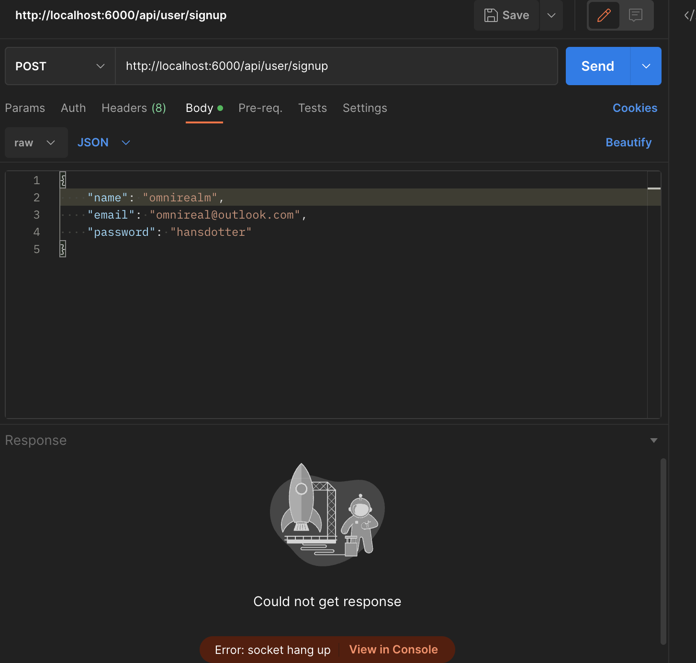
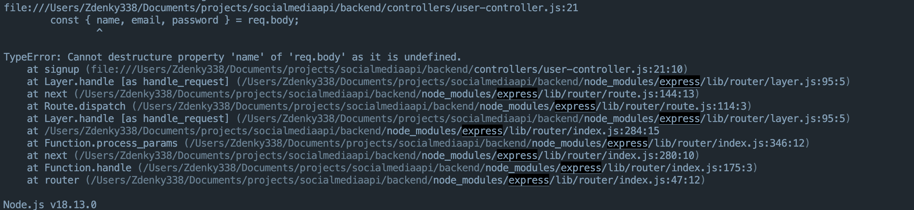

# Build A Social Media Backend REST API With Node.JS
![]
Tutorial URL: https://www.youtube.com/watch?v=_ee38nL13mE
Tutorial description:

___________

### Software versions

### Problems in the project:

1. Cannot destructure property 'name' of 'req.body' as it is undefined.
	The problem was the server didn't know what data is what receiving from the node js module

2.

### How to use

### Photos of project:

### Apps used:

Firefox Developer Edition URL: [https://www.mozilla.org/en-US/firefox/developer/](https://www.mozilla.org/en-US/firefox/developer/)

Postman URL: [https://www.postman.com/](https://www.postman.com/) 

Sublime Text: [https://www.sublimetext.com/](https://www.sublimetext.com/) 

Tabby: [https://tabby.sh/](https://tabby.sh/) 

GitHub CLI: [https://cli.github.com/](https://cli.github.com/) 

MongoDB Compass URL: [https://www.mongodb.com/products/compass](https://www.mongodb.com/products/compass)

### Coding styles I used:

### What I learned
1. How to use modules in expressJS
Benefits:
 Use 'import' instead of const or var.

	First define the package scope by the type flag in package.json as "module"
	Second, add the --es-module-specifier-resolution=node flag in first order of the npm start command to run the module style code with node.