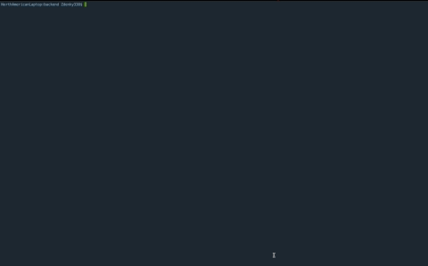

# Build A Social Media Backend REST API With Node.JS
![]
Tutorial URL: https://www.youtube.com/watch?v=_ee38nL13mE
Tutorial description:

___________

### Software versions

### Problems in the project:


1. Cannot destructure property 'name' of 'req.body' as it is undefined.
	The problem was the server didn't know what data is what receiving from the node js module. Solution: Add express.json() middleware after initializing the express application.

### How to use
1. clone / download
2. cd into backend
3. npm install 
4. npm start.
5. Use Postman since It's a JSON and HTTP-based application to 
	For routes:
		User-based routes:
			POST /api/user/signup
				- Creates a user
			POST /api/user/login
				- Logs in to a user account
				- Requires same password as signup
			GET /api/user
			 	- Returns an Array of user accounts.
		Blog based routes:
			GET /api/blog
				- Returns all blogs
			POST /api/blog/add
				- Creates a new blog
				4 required fields which are all strings:
					title,
					description,
					image and user
			PUT /api/blog/update/:id
				- Updates a blog
				Requires the mongoDB id of the blog object


### Photos of project:


### Apps used:

Firefox Developer Edition URL: [https://www.mozilla.org/en-US/firefox/developer/](https://www.mozilla.org/en-US/firefox/developer/)

Postman URL: [https://www.postman.com/](https://www.postman.com/) 

Sublime Text: [https://www.sublimetext.com/](https://www.sublimetext.com/) 

Tabby: [https://tabby.sh/](https://tabby.sh/) 

GitHub CLI: [https://cli.github.com/](https://cli.github.com/) 

MongoDB Compass URL: [https://www.mongodb.com/products/compass](https://www.mongodb.com/products/compass)

### Coding styles I used:
Contents of the object on the next line and tabbed.
```
	// Correct!
	if(!blog) {
		return res.status(404).json({ 
			message: 'No blog found'
		})
	}
	// Wrong!
	return res.status(200).json({blog})
```

### What I learned
1. How to use modules in expressJS
Benefits:
 Use 'import' instead of const or var.

	First define the package scope by the type flag in package.json as "module"
	Second, add the --es-module-specifier-resolution=node flag in first order of the npm start command to run the module style code with node.
